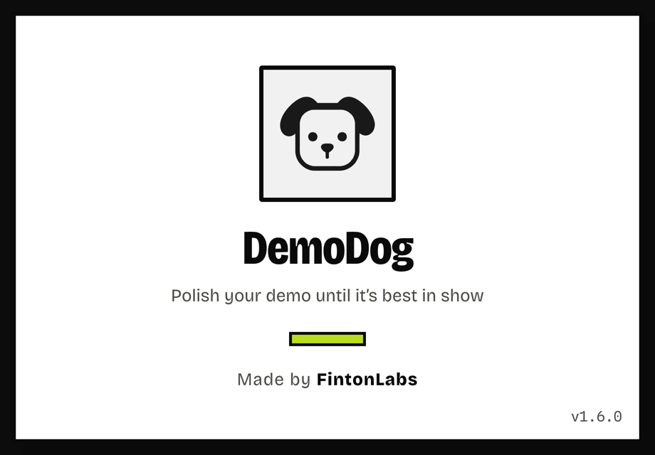
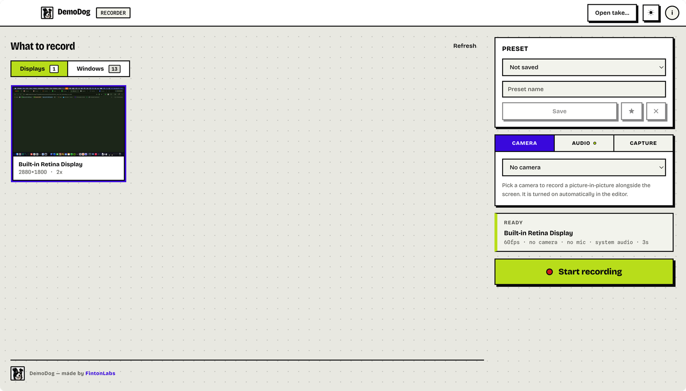
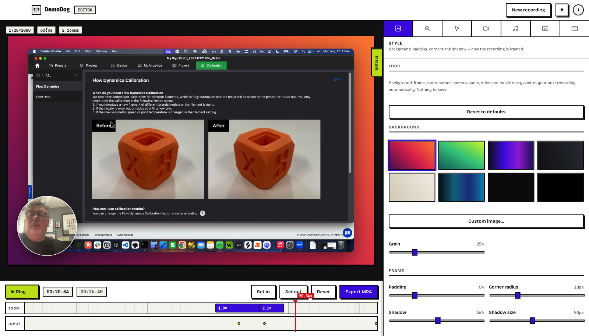

<div align="center">



# DemoDog

**A screen recorder for macOS that edits itself.**

Record, and it comes back with the zooms already placed, the cursor smoothed,
and your camera in the corner.


</div>

---

## Getting started

### 1. Install

Download the latest **`DemoDog-<version>-arm64.dmg`** from
[Releases](../../releases), open it, and drag DemoDog to Applications.

The app is signed with an Apple Developer ID and notarised by Apple, so it opens
with a normal double-click — no right-click, no `xattr`, no security warning.

Apple silicon, macOS 14 (Sonoma) or later. There is nothing else to install —
no Python, no runtime, no command line tools. Everything is inside the app.

### 2. Grant Screen Recording

The first time you record, macOS asks for **Screen Recording**. DemoDog cannot
capture anything until you allow it.

> System Settings → Privacy & Security → Screen Recording → enable **DemoDog**

Then quit and reopen DemoDog. Camera and microphone are only requested if you
choose to use them, and **Accessibility** is optional — it is used solely for
the keyboard-shortcut overlay.

### 3. Record something



1. Pick a **display** or a **window**. Live thumbnails show what each one is.
2. Optionally choose a **camera** and a **microphone** in the tabs on the right.
3. Check the summary above the button, then press **Start recording**.
4. A **3-2-1 countdown** appears over your screen, then recording begins.
5. Press <kbd>⌘</kbd><kbd>⇧</kbd><kbd>2</kbd> to stop — from anywhere, without
   hunting for the window.

Recordings are saved to `~/Movies/DemoDog/`.

> **Tip — save a preset.** Once your source, camera and microphone are set the
> way you like, type a name in the **Preset** box, press **Save**, then press
> **★**. Next launch it loads automatically, so recording is one click.

### 4. It edits itself



The editor opens as soon as you stop, already edited:

- **Zooms are placed for you**, from where you clicked, scrolled and switched
  apps. Each is a block on the timeline you can drag, resize, re-level or delete
  (**✕** on the block, or select it and press <kbd>Delete</kbd>).
- **The cursor is redrawn**, smooth and crisp, with a click effect. It is not
  the recorded pointer — the recording contains no cursor at all — so its size,
  style and shape are all changeable afterwards.
- **Your camera** appears as a bubble that moves aside when the pointer nears it.

Press <kbd>Space</kbd> to play, arrow keys to step a frame at a time.

### 5. Make it yours

The tabs on the right cover everything:

| Tab | What is in it |
|---|---|
| **Style** | Background, padding, corner radius, shadow, fade in/out, output size, and **profiles** |
| **Zoom** | How often it zooms, how long shots hold, how much of the take is zoomed |
| **Cursor** | Size, smoothing, style, shape, click effects, spotlight |
| **Camera** | Bubble shape, position, size, framing, audio levels |

> **Tip — save a look.** In **Style → Profile**, name your settings, press
> **Save**, then **★**. Every new recording then opens with that look already
> applied.

### 6. Export

**Export MP4**, or <kbd>⌘</kbd><kbd>E</kbd>. Use **Set in** and **Set out**
first if you only want part of the take.

Export is currently slow — roughly 3 frames a second — because it steps the
source video frame by frame. A 30 second recording takes a few minutes.

---

## Common questions

**Where are my recordings?** `~/Movies/DemoDog/take_<timestamp>/`. Each take is
a folder holding the video, the input log and a little metadata. Reopen one with
**Open take…**.

**Why are there no zooms on my recording?** DemoDog zooms in on things you *do* —
clicks, scrolling, switching apps. A take where you only moved the mouse has
nothing to zoom in on. The Zoom tab says what it found, and you can always
double-click the zoom lane to add one by hand.

**Why does it start zoomed out?** Deliberately. A recording that opens already
zoomed never shows the viewer what they are looking at. Adjust it with
**Opening wide shot** in the Zoom tab.

**Can I record system audio?** Yes, it is on by default, and needs no extra
driver or virtual audio device.

**Does it record my keystrokes?** Only modifier combinations such as ⌘K, and
only if you switch on the shortcut overlay. Plain typing is never recorded.

---

## Building from source

Only needed if you want to change it.

```bash
git clone https://github.com/justynroberts/demodog.git
cd demodog
npm install          # also compiles the Swift capture helper
npm run dev          # run it
npm run dist         # build a .dmg into release/
```

Node 20+ and Xcode command line tools (`xcode-select --install`) are required —
the capture helper is compiled from Swift.

For the architecture and the reasoning behind the engine, see
[`CLAUDE.md`](CLAUDE.md). For the visual system, see [`DESIGN.md`](DESIGN.md).

---

## Licence

MIT — © [FintonLabs](https://fintonlabs.com)
