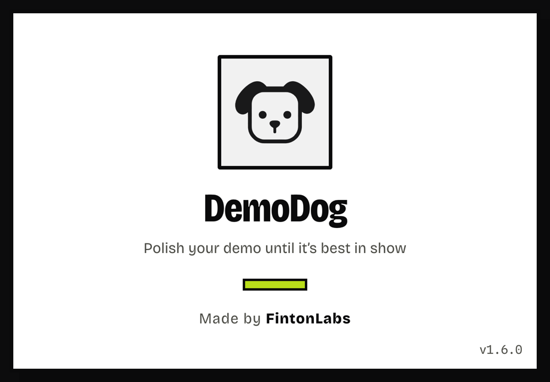
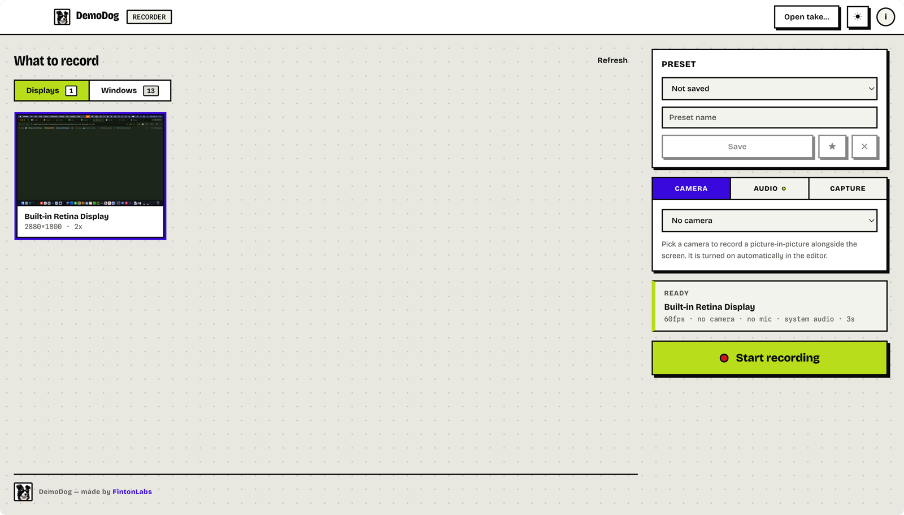
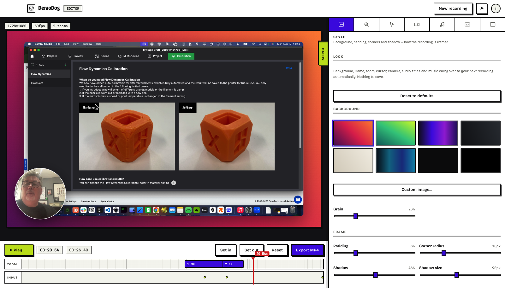

# DemoDog

**Polish your demo until it's best in show.**

A screen recorder for macOS that edits itself.

Record, and it comes back with the zooms already placed, the cursor smoothed,
and your camera in the corner.

---

## What it does

| | |
|---|---|
| **Zooms itself** | Shots are placed from what you actually did — clicked, scrolled, switched apps. Each one is a block on the timeline you can drag, resize, re-level or delete. |
| **Redraws the cursor** | The recording contains no pointer at all, so the one you see is drawn afterwards: smoothed, resizable, restyled, with a click effect. Nothing is baked in. |
| **Camera picture-in-picture** | A bubble that follows the take and moves aside when the pointer nears it. Shape, size, position and framing are all changeable after the fact. |
| **Captions, on this Mac** | Transcribe your narration offline — nothing is uploaded. Lines arrive short enough to read at a glance, and split or merge with a keystroke. |
| **Point at things, or hide them** | Draw an arrow, a box, a highlight or a focus onto the recording after the fact — or blur and pixelate a password or an email address. They follow the zoom. |
| **Intro and outro cards** | A title, a subtitle and a logo either side of the take. Extra time rather than separate clips, so they scrub, fade and export like everything else. |
| **A music bed** | Drop in an MP3, WAV or M4A, with optional ducking so it steps back under your narration and comes up again after. |
| **Records a window or a display** | Pick either. A window is captured on its own, wherever it sits and whatever is in front of it. |
| **System audio and microphone** | Both, with no extra driver and no virtual audio device. |
| **Sticky settings** | However you left the look — background, camera, zoom feel, titles, music — is how the next recording opens. Nothing to name or save. |
| **Exports fast** | A 26-second take is an MP4 in under eight seconds, most of that the encoder finishing. |
| **Keeps itself up to date** | It finds new versions, downloads them in the background and asks before restarting. Never mid-recording. |
| **Private by default** | No account, no telemetry, no uploads. The only network request it makes is checking GitHub for a newer version. |

Signed and notarised by Apple. Universal — Intel and Apple silicon. Free, MIT.

---

## Getting started

### 1. Install

Download the latest **`DemoDog-<version>-universal.dmg`** from
[Releases](../../releases), open it, and drag DemoDog to Applications.

It opens with a normal double-click — no right-click, no `xattr`, no security
warning. macOS 14 (Sonoma) or later. There is nothing else to install: no
Python, no runtime, no command line tools. Everything is inside the app.

### 2. Grant Screen Recording

The first time you record, macOS asks for **Screen Recording**. DemoDog cannot
capture anything until you allow it.

> System Settings → Privacy & Security → Screen Recording → enable **DemoDog**

Then quit and reopen DemoDog. Camera and microphone are only requested if you
choose to use them, and **Accessibility** is optional — it is used solely for
the keyboard-shortcut overlay.

### 3. Record something

1. Pick a **display** or a **window**. Live thumbnails show what each one is.
2. Optionally choose a **camera** and a **microphone** in the tabs on the right.
3. Check the summary above the button, then press **Let's Start**.
4. The floating bar appears and, if you chose a window, that window comes to the
   front — so you can arrange things before you commit.
5. Press **Start recording** on the bar. A **3-2-1 countdown** appears over the
   screen you are capturing, then recording begins.
6. Press <kbd>⌘</kbd><kbd>⇧</kbd><kbd>2</kbd> to stop — from anywhere, without
   hunting for the window.

Recordings are saved to `~/Movies/DemoDog/`.

> **Tip — save a preset.** Once your source, camera and microphone are set the
> way you like, type a name in the **Preset** box, press **Save**, then press
> **★**. Next launch it loads automatically, so recording is one click.

### 4. It edits itself

The editor opens as soon as you stop, already edited. Click anywhere on the
timeline to move the playhead. <kbd>Space</kbd> plays, the arrow keys step a
frame at a time (hold <kbd>⇧</kbd> for a second), <kbd>Delete</kbd> removes the
selected zoom.

> **Tip — frame a shot by hand.** Press **Choose the area on the preview** in
> the Zoom tab and drag a box around what should fill the frame. The
> magnification is worked out from the box, so you never type a number. With a
> shot selected it reframes that one; with nothing selected it makes a new one
> at the playhead.

### 5. Make it yours

The **MENU** tab on the right opens the panel. Its icons cover everything —
hover one and the line underneath says what it is:

| Tab | What is in it |
|---|---|
| **Style** | Background, padding, corners, shadow, fade in/out, output size |
| **Zoom** | How often it zooms, how long shots hold, how much of the take is zoomed |
| **Cursor** | Size, smoothing, style, shape, click effects, spotlight |
| **Camera** | Bubble shape, position, size, framing, sync |
| **Audio** | Levels for the recording and the microphone, and a music bed under it all |
| **Captions** | Transcribe the narration, keep lines short, split and merge them, and style them |
| **Annotate** | Arrows, boxes, highlights and focus — and blur or pixelate to hide something |
| **Titles** | Intro and outro cards either side of the recording |

> **Tip — there is nothing to save.** Settings are sticky. Whatever the
> background, camera bubble, zoom feel, titles and music were left as, the next
> recording opens with. **Style → Look → Reset to defaults** puts them back.

### 6. Captions, without uploading anything

In **Captions**, press **Transcribe**. The narration is recognised **on this
Mac** — nothing is sent anywhere — and becomes timed lines on the timeline.
Click a line to jump to it and edit the words in place, so a misheard name is
fixed rather than re-transcribed.

**Lines stay short.** With **Keep lines short** on, a transcript arrives broken
into captions of at most 42 characters — one line you can take in at a glance
rather than a paragraph over the recording. Breaks go after a comma or full stop
where one is close, never leave a word on its own, and fall in the real pause
between two words. Change the length with **Longest line**; **Shorten … lines
now** applies it to a transcript you already have.

**Work up close.** The timeline shows the whole take until you zoom in:
⌥-scroll or pinch to zoom where the pointer is, two fingers to scroll along it,
<kbd>+</kbd> and <kbd>−</kbd> from the keyboard and <kbd>0</kbd> for the whole
take again. A strip under the lanes shows where you are; drag it to move. Press
<kbd>T</kbd>, or double-click the ruler, to give the timeline the window and get
taller lanes. Edges snap to the playhead, to the trim, to other blocks and to
the clicks in the recording — hold <kbd>⌥</kbd> while dragging to place one
freely.

**Undo anything.** <kbd>⌘</kbd><kbd>Z</kbd> steps back through every edit —
shots, marks, captions, the trim, any setting — and <kbd>⇧</kbd><kbd>⌘</kbd><kbd>Z</kbd>
forward again. A slider drag undoes in one press, not one frame at a time.

**Subtitles in another language.** The **Subtitles** dropdown translates the
lines into Dutch, French, Portuguese, Spanish or German. The narration is still
recognised in the language it was spoken in — only the subtitle text changes —
and the translation runs on this Mac, so the recording still goes nowhere.
Whole sentences are translated rather than the short lines on screen, then
shared back across them, so each caption keeps its own timing. Switching back to
the spoken language restores the words exactly as they were said. The first time you
pick a language, macOS asks whether to download it — answer yes and the
subtitles follow on their own. It is downloaded once and shared by every app on
the Mac, and you can manage them under System Settings → General → Language &
Region → Translation Languages.

**Split and merge by hand.** Select a line, put the cursor where it should
break, and press <kbd>⌘</kbd><kbd>↩</kbd> (or **Split at cursor**). The rest of
the line is selected next, so a long line breaks up one keystroke at a time.
**Merge with next** puts two lines back together.

Font, size, weight, colour, position, alignment, outline, shadow, a backing
plate and a fade at each end are all adjustable, and the styling carries over to
your next recording along with everything else.

### 7. Point at things, or hide them

In **Annotate**, choose a mark and drag on the preview:

| Mark | For |
|---|---|
| **Arrow** | Pointing at a button or a field — drag from the tail to the point |
| **Box** | Drawing a rectangle around something |
| **Highlight** | A translucent marker over a line of text |
| **Focus** | Dimming everything except one area |
| **Blur** / **Pixelate** | Hiding a password, an API key, an email address or a name |

A mark starts at the playhead and lasts three seconds. Drag its ends on the
**Marks** lane to change that, or use **Start at playhead** and **End at
playhead**. Colour, thickness and strength are in the tab; **Redraw on preview**
puts it somewhere else, and <kbd>Delete</kbd> removes it.

Marks are drawn on the recording itself, so they follow the zoom — a box drawn
around a button stays around that button as the camera moves in. Blur and
pixelate never fade in or out: whatever they hide is covered from their first
frame to their last.

### 8. Music under it all

In **Audio**, add an MP3, WAV or M4A as a music bed. Set its level, how it fades
in and out, and whether it **ducks** — steps back while you are speaking and
comes up again after. Ducking follows the transcript, so transcribe first if you
want it; without captions there is nothing for it to duck against. It is
optional either way, and some demos want the music flat underneath.

### 9. Intro and outro cards

In **Titles**, give the recording an opening and a closing card — a title, a
subtitle and an optional logo, held for as long as you like.

They are extra time either side of the take rather than separate clips, so they
scrub, preview, fade and export exactly like the recording. Turn one on and it
appears on the timeline as its own lane.

### 10. Export

**Export MP4**, or <kbd>⌘</kbd><kbd>E</kbd>. Use **Set in** and **Set out**
first if you only want part of the take. You choose the name and the folder
before rendering starts.

When it is done, **Publish to YouTube** writes the captions beside the video as
an SRT file, puts the title and chapter marks on the clipboard, opens YouTube
Studio and reveals the file ready to drag in. It is a handoff rather than an
upload, deliberately: uploading through YouTube's API needs a verified app, and
until one is verified every video it uploads is locked to private with no
appeal.

---

## Common questions

**Where are my recordings?** `~/Movies/DemoDog/take_<timestamp>.demodog`. Each
take is a package holding the video, the input log and a little metadata —
double-click it to reopen, or use **Open take…**. Your edits are kept inside it
as you work: captions, marks, zoom shots, the trim and the camera sync are all
there when you open the take again, even after quitting. The look — background,
cursor, caption style — is not per take; it follows you to the next recording.

**Why are there no zooms on my recording?** DemoDog zooms in on things you *do* —
clicks, scrolling, switching apps. A take where you only moved the mouse has
nothing to zoom in on. The Zoom tab says what it found, and you can always
double-click the zoom lane to add one by hand.

**Why does it start zoomed out?** Deliberately. A recording that opens already
zoomed never shows the viewer what they are looking at. Adjust it with
**Opening wide shot** in the Zoom tab.

**Can I record system audio?** Yes, it is on by default, and needs no extra
driver or virtual audio device.

**Does it record my keystrokes?** Only modifier combinations such as ⌘K, and
only if you switch on the shortcut overlay. Plain typing is never recorded.

**Is my narration sent anywhere to be transcribed?** No. Recognition runs on
this Mac, offline, using the speech model macOS already ships. DemoDog makes no
network requests at all except to check GitHub for a newer version.

**Transcribe found nothing.** The first run for a language downloads a model,
which takes a moment. If it keeps finding nothing, check the spoken language in
the Captions tab — it defaults to English rather than to whatever your Mac is
set to, because those are often not the same thing.

**Something went wrong and I want to report it.** The ⓘ button has **Report a
bug**, which attaches the version, this Mac's details and the app's logs. Never
a recording, its audio or its transcript.

**The update said it restarted but I am still on the old version.** Fixed in
1.0.6. Older copies need one manual update from
[Releases](../../releases/latest); after that the automatic path works.

---

## Building a demo without recording one

DemoDog can assemble a finished video from a script — a browser driven by
Playwright, plus a list of what it clicked and when, becomes a take and gets the
automatic zoom, the smoothed cursor, the click animation and the captions for
free. It can also be driven over MCP by a local model. See [`MCP.md`](MCP.md).

## Changing it

See [`DEVELOPMENT.md`](DEVELOPMENT.md) — building from source, the test fixture,
and how the engine fits together.

## Licence

MIT — © [FintonLabs](https://www.fintonlabs.com)
